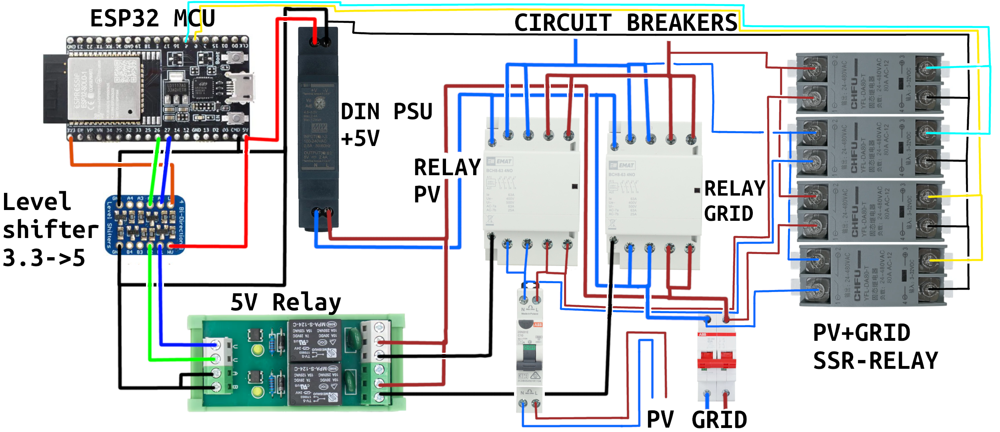

# A new revision of the Home battery ATS

When we bought the solar panels for our home, we had to buy an inverter. **We bought an offgrid inverter**, by accident (it was mentioned in the datasheet, but looked over by us while choosing the inverter). **Instead of returning it, we made it a project**.  As we are now already using an off grid inverter we also bought a matching 10KWh battery system along it.

## Current system

We of course wanted to use the solar panel system as soon as possible. At the time I quickly hacked a system together which works well but still has its quirks. 

**Here is a quick overview of the current system:**

How this system works is by switching the house main line (before conventional circuit breakers). The system switches between the power grid and the inverter output using two 63A 230V relays and four 80A SSR-relays (2xneutral and 2xphase).

The **solid state relays** are used to **limit the wear and tear on the mechanical relay contacts** and are only **switched on/off momentarily** (due to big power losses, voltage drop of 1.5V AC also means ~16W of heat being pumped into the breaker box).

The relays are controlled by an esp32 microcontroller hosting a local webpage, which allows us to manually switch from Grid to PV. 

**ESP32 webpage:**

Yes, it is just a switch! It has to be dad-proof :)

## Quirks of the current system

Nothing wrong with this system, right?

Well... It's hacked together, so there are of course some quirks:

- If there is a grid power outage, the whole house does not have power (as the 63A relays have a 230V coil voltage, which is fed from the grid)
- Sometimes the timing of the relays is too far off due to not timing it properly in software, this causes the GFCI breakers to trip
- It could use some more protections. No way to know if there is a failure somewhere (e.g. SSR gets stuck or level shifter has failed).
- The switching still happens manually and requires us to keep an eye on the battery percentage, this can be automated!
- It uses a hobby grade cheap ESP32 microcontroller, which I rather remove from the Wi-Fi network (due to privacy concerns)
- No control of power to individual breakers. Annoying, because we use an induction cook top. Which means that when cooking for dinner, we throw away a lot of power budget of the inverter (inverter == 5000W), which means when using more than two pits, we draw almost 4500W. Which leaves 500W for the rest of house. My mother then still uses the close-in boiler for hot water which is 2000W and overloads the inverter.
- No control of power to individual breakers also means that in the winter, we can not use the complete battery systems capacity completely.

## New revision

For school, I coincidently also have a school subject on functional safety, well it is not that the current system is completely unsafe. I thought that it was a good incentive to improve the current system, as the design also helps me to pass the subject's assignment.

How to tackle this? I came up with the following improvements:

- Use 24V relays instead of the currently used 230V relays. So that the system can be powered from battery, doesn't turn off in outage, easier to control, less switching noise.
- Individually control the power of some of the largest power consumers (e.g. induction cook top, oven, boiler) with a separate relay
- Add hardware protections on the control lines to the relays
- Add energy monitors with Modbus, to have insight into the current usage which in turn hopefully prevents overloading the inverter
- Replace the ESP32 with a wired Ethernet controlled MCU from another manufacturer
- Let the MCU also automatically switch power.
- Design my own 4-layer PCB and enclose it with a metal enclosure (for noise and emc reasons)