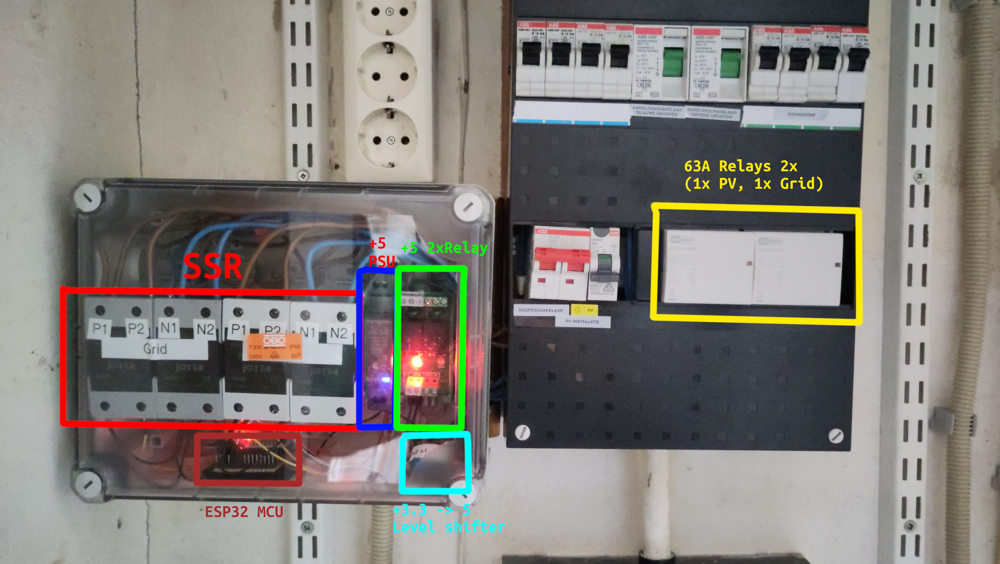
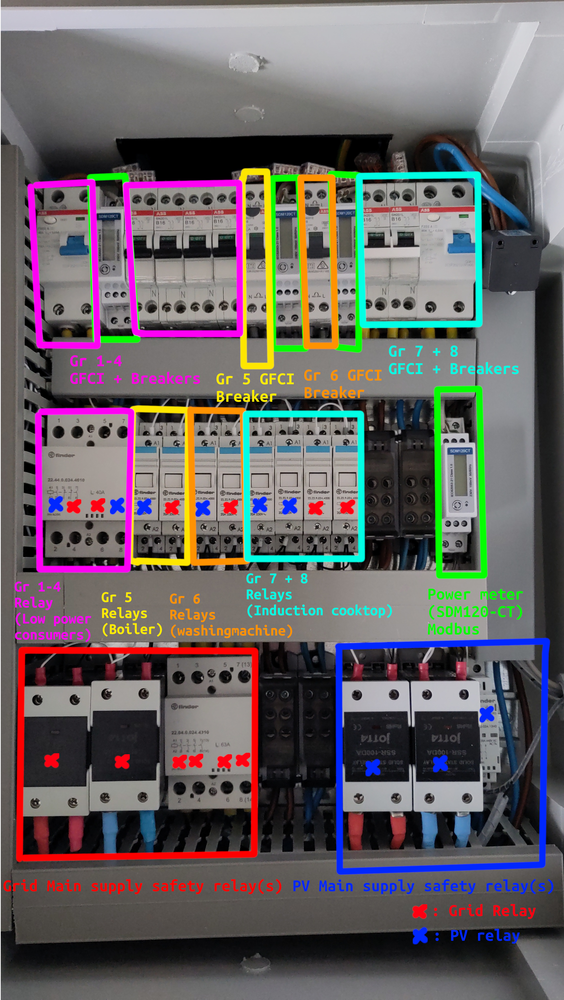
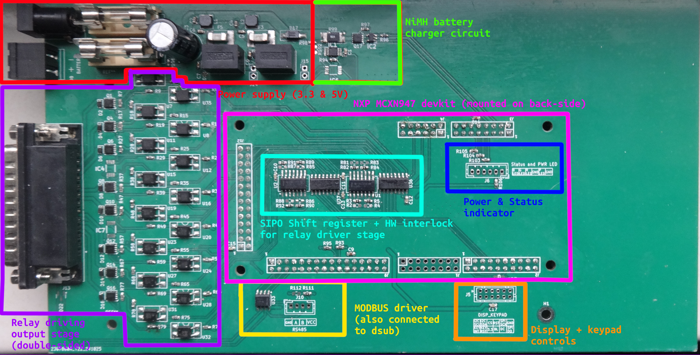

# Hardware design for the Homebattery ATS has been finalized

As introduced in blog post [Conceptualization new revision of the Homebattery ATS ](00_ats_switch_concept.md),  I am building a new ATS system for our PV system. 

I am happy to announce that the first revision of the new hardware is now assembled and ready to be tested! 

## New circuitbreaker panel

To accommodate my new PCB design, I also need to replace the original 230V relays with smaller 24V relays. Because of the new topology of switching all big power consumers seperately from all the other electronic devices in the house, a lot more relays are needed then before. So a complete redesign of my breaker box was needed.

Old system:

New system:

Okay, I understand the new system is a bit more complicated, but it offers a lot more safety and control than the old system.

Each big power consumer in the house now has it's own breaker, relay stage (with a separate relay for PV and Grid) and power meter. Besides this all relays are replaced with Finder 24V relays which can be switched from battery power, so that in an outage the whole house does not lose power. An added benefit is lower power losses as the relays can be switched with low on-resistance mosfets. 

The power meters (SDM120-CTM) allows for measuring the power consumption and reading it from the modbus interface. Very useful! As it helps the system switch quickly when the inverter is nearing its power limit. And it helps to estimate whether the relay contacts are wearing out/not switching properly.

Not visible in the picture, but the whole new breaker box is also fitted with temperature sensors, which detect if any of the relays are getting hot. As there are some multi-contact relays, which might switch properly on 1/2 contacts but the other one's can be worn out, increasing the contact resistance and also generating heat (sometimes not measurable through power meters). For safety it might be a good idea to detect it and warn so that we can replace the relay early and reduce risk of fire.

Mandated by law (nen1010) and for our own safety we added GFCI everywhere (also on the output of the PV inverter) (we also have a Grid main switch, but it is not shown in picture). So even if this system fails, we can not damage our inverter, get shocked to death or have the risk of our main fuse breaking (which is really expensive to get replaced).

## Manual override panel

Sometimes we want to go on a relaxing vacation without having to worry about the ATS being active. To disable the ATS and override the relays we have a panel with Manual override switches. Which is placed between every relay switching wire and allows us to control the relays manually. The other end of the switch obviously connects to the new metal box with our custom-pcb.

## Custom PCB Prototype

The smart brain of the system consists of a newly designed pcb. Which is my first ever 4-layer pcb, Of course the pcb is oversized (it had to fit in eurocard sized enclosure, it fits, but should have made pcb less wide to save materials).

The custom PCB I designed has the following hardware:

- NXP MCXN947 devkit (Dual Arm Cortex-M33 with NPU and Ethernet Phy)
- 16 p-ch mosfet + optocoupler driven output channels (for driving the relays)
- On-board temperature monitoring
- Modbus drivers
- Battery charging circuit for (16s) NiMH battery
- A lot of fuses (both Glass and SMD)

### MCU choice

Of course, I could have fitted my design with a new and shiny ESPxx whatever. But this time I really wanted to go for an Arm-based solution and play a bit with some of the new NXP microcontrollers. Yes, the NXP MCXN947 is way overkill for this application, as it has to run a MQTT client, Web scraper, Web server, some code that accurately switches the relay within half an ac cycle, battery charging code and maybe a graphics framework (such as LVGL). This could have easily ran on a Cortex-M3/4 part. 

But the fact that this is a new platform, which has a long support cycle (until 2035, I believe). Devkit with built-in Phy, cheap (<20 Euro), easy to CMake, usable hal, great low power modes and huge flash/ ECC ram (468(ECC)/512KB ram & 2MB Flash). Means that I have a lot of room to improve the software and make the whole system more efficient.

The MCU is also connected to our home network by Lan and scrapes our Victron Cerbo for current Battery and Inverter statistics. In the future it will try to scrape the local solar farm website (which have comparably sized solar panels), so that an estimation of power can be made. Eventually with the goal to optimize usage of solar throughout the night and partly the day (as Energy at nighttime is the most expensive and polluting).

### Power supply and Battery charger

The power supply circuit uses two recom dc-dc power supply modules (1x3.3V and 1x5V). This is mainly to save on design time and reduce risk on EMI/EMC effects. 

The battery charger uses a p-channel mosfet driven by a gate-driver which can be PWMed to charge the attached NiMH battery to the right battery level. The reason I chose to use NiMH is that it is a very stable & safe battery chemistry. Which doesn't catch fire when mishandled. Talking about mishandled there is a temperature sensor nearby (not populated, at the moment) which can be used to check if any heat is produced (which should not happen obviously (low RDSon, Fused & over-dimensioned)). But just in case.

### Mosfet output stage

The output stage uses p-channel mosfets with low on-resistance of 0.01 ohm to keep power losses as low as possible. The gates of these mosfets are driven by optocouplers which decouple the 24V line and 3.3V line, to reduce EMI/EMC. The drain of the mosfet is also connected to an optocoupler to provide feedback to the microcontroller and hardware interlock.

The optocouplers are then driven by two 8-bit SIPO shift registers and an AND-gate which prevents the Grid and PV relay to turn on at the same time.

### Display and Keypad

The display and keypad header allows for connecting an SPI-based display (with DC-line). And an I2C-based keypad using an IO-expander. 

### MODBUS

The whole modbus shenanigans are needed for the Power meter and Temperature sensors inside the new circuit breaker box.

## Schematic and design files

The schematic and design files are on [GitHub](https://github.com/Hoog-V/Gridswitcher_V2).