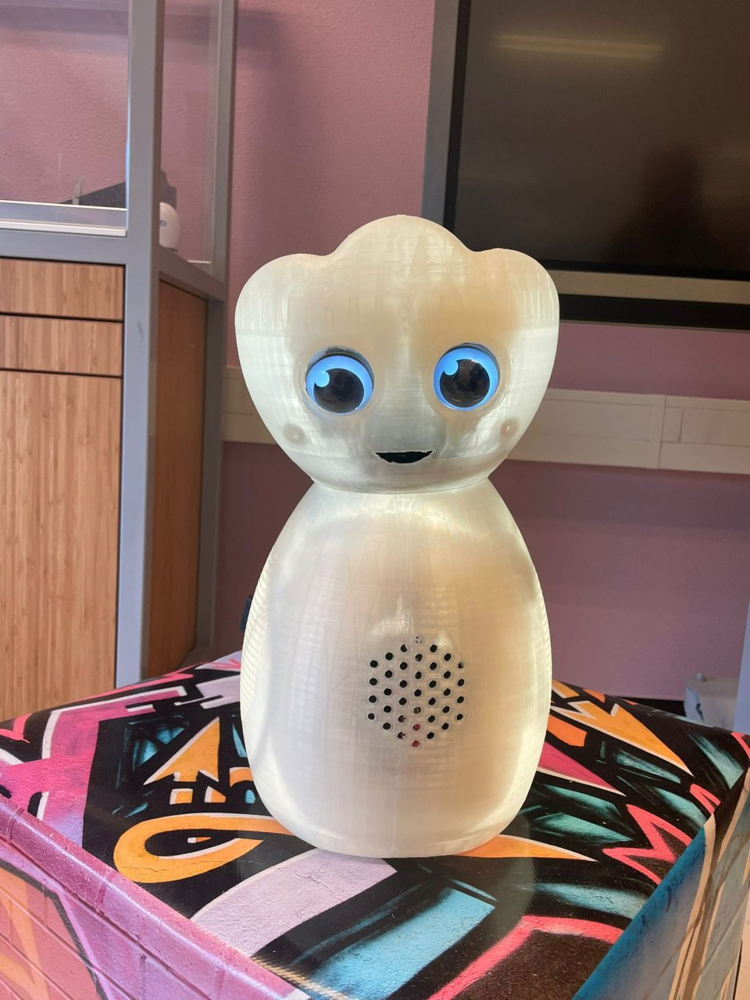
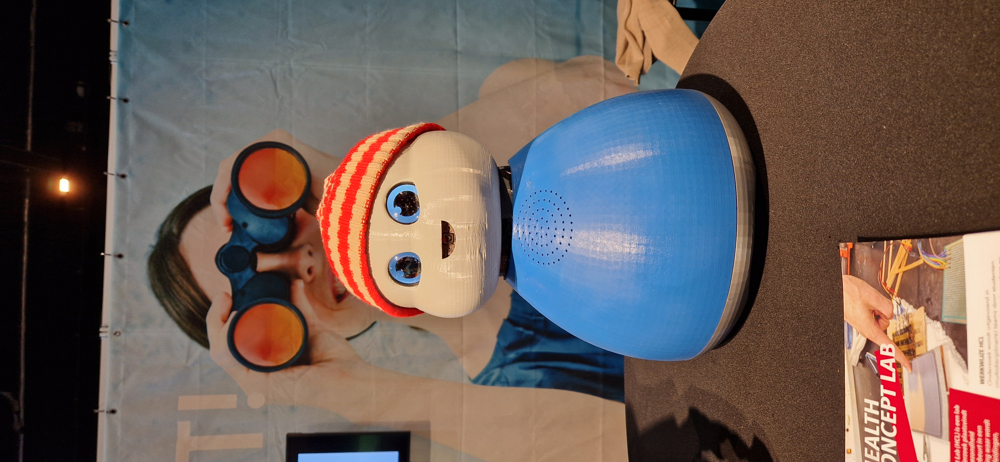
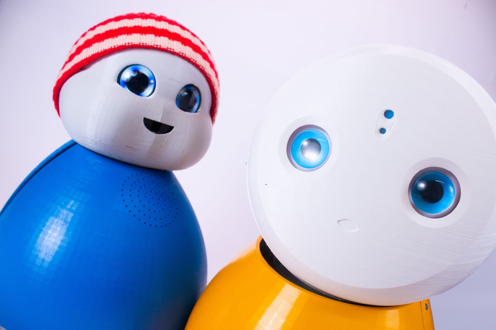

# Healthbot

De bevolking van Nederland vergrijst in rap tempo, wat grote gevolgen heeft voor de samenleving.
Ouderen zullen langer zelfstandig thuis moeten wonen, terwijl de arbeidskrapte in de zorgsector
verder toeneemt. Steeds meer zorgtaken komen hierdoor in handen van familie en kennissen. Het zorgen voor
familieleden kan intensief zijn, ook al zijn het misschien een paar uurtjes per week. Deze zorgen draag
je desondanks toch mee naar werk en andere dagelijkse bezigheden.

Wij kwamen dan ook met de vraag: **hoe kunnen we de mantelzorgers ontlasten en de zorg voor hun
naasten verbeteren?**

Als een groep van studenten hebben we ons verdiept in wat wij kunnen doen om er voor te zorgen dat onze opa/oma wat meer aandacht en gezelligheid heeft en er
ook nog een vorm van sociale controle is.

Hieruit is Robo ontstaan, een zorgrobot die:
- Praten kan, vergelijkbaar met Google Assistent, maar volledig open source, lokaal en transparant
- Gegevens kan verzamelen voor het draadloos meten van hartslag- en het ademhalingsritme.
- Oogcontact kan maken en de locatie kan inschatten van een persoon in de kamer.
- Een leuke uitstraling heeft, met een uiterlijk dat aangepast kan worden naar persoonlijke voorkeur.

## Hoe gebruik ik een Healthbot
De healthbot staat op een vaste plek in de kamer en monitort de leefpatronen van de gebruiker.
Bijvoorbeeld, als de gebruiker ’s ochtends langsloopt, vraagt de robot: “Goedemorgen, heeft u lekker geslapen?”. Op basis van het antwoord kan de robot verder vragen naar de slaapkwaliteit en indien nodig, dit terugkoppelen naar een thuiszorgorganisatie, familielid of zorgverlener. Als de gebruiker langer wegblijft dan normaal, stuurt die automatisch een bericht naar de zorgverlener of een familielid. Healthbot fungeert ook als persoonlijke assistent, het informeert de gebruiker over het laatste nieuws op interessegebieden en houdt een agenda bij met afspraken.

## Sponsoren/partners
We hebben de volgende sponsoren/partners:
- HAN University of Applied Science
- Oneplanet research
- De Driegasthuizengroep
- Woongroep Dichterbij

## Contact
Heeft u advies, of wilt u graag sparren en ons verder helpen? Wij staan daar voor open, neem alstublieft via onderstaande kanalen contact met ons op.

Stuur een mail naar: vo.hogeweij@student.han.nl. Bel naar 0621364476 of stuur een bericht op [Linkedin](https://www.linkedin.com/in/victor-hogeweij-01b08619b/). Heb je de voorkeur voor contact via mijn school dan kan dat ook! Stuur een mail naar jeroen.veen@han.nl. 

## Wie zijn wij
Wij zijn een samenstelling van Industrieel Product Ontwerper, Embedded Systems Engineering en IT studenten die samen aan dit project werken. De groep verschilt van semester tot semester. Maar de kern veranderd niet, dat zijn Jeroen Veen (docent/researcher HAN) & Victor Hogeweij(ik).

Jeroen helpt bij de technische & onderzoekskant van het project. Ik werk aan zowel de Software als Hardware van het project.

## Tijdlijn
Dit is een kort overzicht van de tijdlijn waarin dit project is ontwikkeld.

### November 2023
In November 2024, is het eerste prototype gebouwd in de vorm van een Robot hondje. De robot zelf is een kant en klare robot, waar we onze eigen elektronica in hebben gezet. Met dit prototype konden we de (begin)stappen zetten voor het detecteren van gezichtsuitdrukkingen.

### Januari 2024
In Januari 2024, zijn mijn docent en ik gestart met het Healthbot project. Binnen dit semester hebben we samen met zes andere studenten exploratief onderzoek gedaan naar het toepassen van bepaalde technologieen, zoals: Radar voor vital signs monitoring, het toepassen van LLMs & spraaksynthese d.m.v. genai en een aantal nieuwe behuizingen. Dit resulteerde in Robo, hier krijgen we dan ook zoveel positieve reacties op, dat we op aanraden van de school, ons op hebben gegeven voor de innovatiefste student.

### Augustus 2024
Augustus 2024, kregen we te horen dat we in de finale stonden met een grote meerderheid in de publieksstemmen. Tegelijkertijd splitst de studentengroep waar ik mee werk op, omdat iedereen aan het voorbereiden was voor het volgende semester (Pre-master, Minor in het buitenland, etc.). Hier heb ik toen het voortouw genomen en zowel mezelf als de robot voorbereid op het evenement.

### September 2024
September 2024, werd ik uitgenodigd vanuit de organisatie voor een aanvullend evenement, The Vibe of the Future. Na mijn tekst vergeten te zijn op podium en veel mensen gesproken te hebben, was het toch een geslaagde avond. Hier heb ik diverse mensen ontmoet die me graag verder hielpen. Met veel van deze personen heb ik nog steeds contact.

### Oktober 2024
Oktober 2024, was het dan zover! De finale van de innovatiefste student. We waren goed voorbereid en hebben zelfs een opvolger van Robo gemaakt, ontmoet Tom een zorgrobot die echt alles lokaal kan.

Het was een waardevolle ervaring! Grote zaal (Musis) met veel mensen, dit keer wel mijn tekst onthouden :). We hebben niet gewonnen, maar ik heb hier zoveel nieuwe connecties opgedaan die me hebben geholpen, met advies of een samenwerking.

Ontwikkeling, gaat door! Gedurende deze tijd hebben we een student industrieel product ontwerpen & multimedia design cmd (IT) die hierop gaan afstuderen. Mijn semesterproject groep is helaas niet meer bereid om verder te helpen, hier hebben we gezamenlijk afscheid van genomen en nu ligt de ontwikkeling van Healthbot volledig in de handen van de docent en mij.

### Januari 2025
Paar maanden voorij en we hebben weer een nieuwe toevoeging aan de Healthbot familie, ontmoet Mira. Mira kan hetzelfde als Tom, maar is volledig als bouwpakket in elkaar te zetten door mensen met een afstand tot de arbeidsmarkt. Floor Roosen, heeft met een mooi cijfer hier haar afstudeeropdracht weten afteronden! Hier zijn we natuurlijk heel trots op en wensen haar nog een mooie carriere toe.

### Maart 2025
Maart 2025, worden Oneplanet (onze partner) en ik geinterviewd op Health Valley, hiervoor neem ik Mira & Tom mee. Tom is demobaar en Mira niet helaas.

