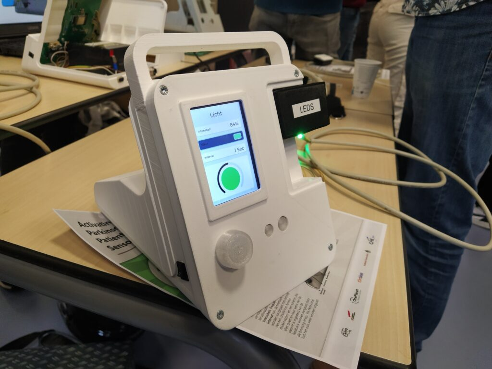
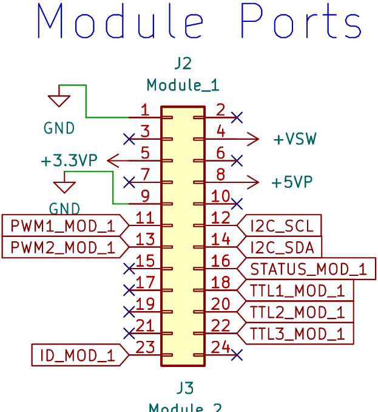

# APPS Project

**For the first second-year project of the Embedded Systems program at HAN, I, along with 4 other students (4 IPO students, 1 ESE student, and 1 ELE student), ended up with the project APPS - Activating Parkinson Patients with Sensors.**

**The goal of this project was to use tactile or visual feedback methods to make Parkinson's patients aware of or help them with a symptom of Parkinson's disease.**

An example of a symptom commonly found in Parkinson's patients is the increasing difficulty in forming sounds.

Scientific research has shown that speaking with a lower and louder voice can alleviate this symptom.

The first dilemma for this project was... which feedback methods work for this target group?

As a project group, we didn’t really get a clear answer to this. For instance, is a vibrating motor perceptible or effective for someone suffering from tremors? Is a blinking LED pleasant? Perhaps a sort of TENS device?

To answer this question, we put in a lot of effort and created a test device for the different feedback methods.

This is the result:

## Design

This was a multidisciplinary project in collaboration with the programs: Electrical Engineering, Embedded Systems, and Industrial Product Design. That's why this product looks so polished.

## Housing

The housing was designed by the IPO students. The design features many soft, rounded corners, inspired by medical devices already on the market.

He also practically added a handle on top of the device so it can be easily carried without damaging the device.

The housing is quite large, mainly due to the choice of a large screen, two module slots, and the size of the battery.

The housing was 3D printed and is made of PLA plastic. The total print time was 80 hours.

## Modules

The system was designed with a modular mindset. This means that the specific hardware (H-bridges, LED drivers, output protection) for a feedback method is built into an external module.

This module connects to a module port with standard pinning, consisting of 2 PWM (or 1 PWM and 1 ADC), 3 TTL, 2 I2C, 1 status, and 1 identification pin(s).

In addition to communication pins, the module port also includes: +12V (unregulated battery voltage), +5V, and +3.3V power pins.

## Graphical User Interface

The GUI was designed in Squareline Studio using the LVGL library.

After designing the GUI, it could be exported from Squareline Studio into .c and .h files, which, with some adjustments, could be integrated into the software design.

## Schematic

The device includes:

    A lead-acid battery (stable and easy to design).
    A custom-designed PCB with an ESP32 microcontroller.
    An ILI9486 3.5″ display (connected via pin header).
    Two module ports.
    A communication port (DB-9) with a micro SD card slot.
    An external emergency stop (metal chassis connector).
    Two buttons and a rotary encoder with a button.

I was responsible for the hardware design

The design can be found on [GitHub](https://github.com/teunrensing/APPS/tree/hardware).

## Software design

The software design utilizes the ESP-IDF framework and drivers. This made the implementation of the software relatively easy. It also helped that the GUI design files could be compiled with small adjustments.

Several modifications were made to make the LVGL library compatible with the hardware. For instance, the LVGL driver for the ILI9486 had to be slightly rewritten to allow control via a shift register.

Additionally, a much newer version of LVGL had to be made to work on the ESP32 than what was available in the examples and documentation.

The implementation itself was not very difficult. We decided to program exclusively in C. My programming partner had difficulties with C++, and it didn’t really benefit the rest of the program to use C++.

The source code can also be found on [GitHub](https://github.com/teunrensing/APPS).