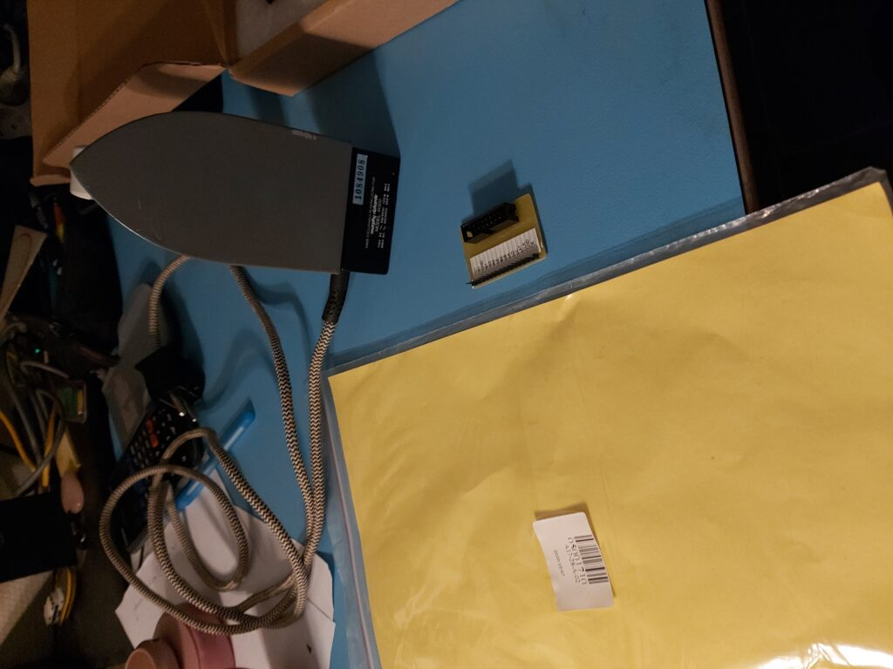
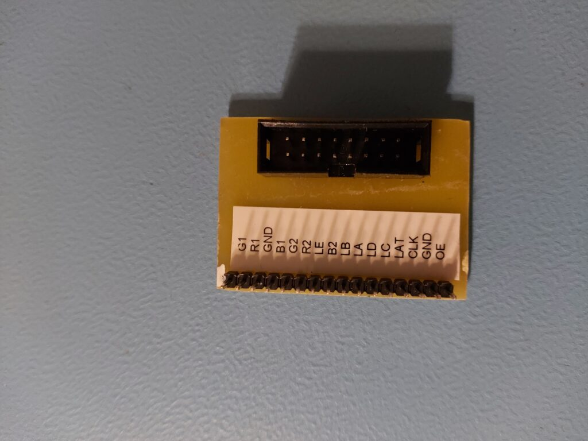
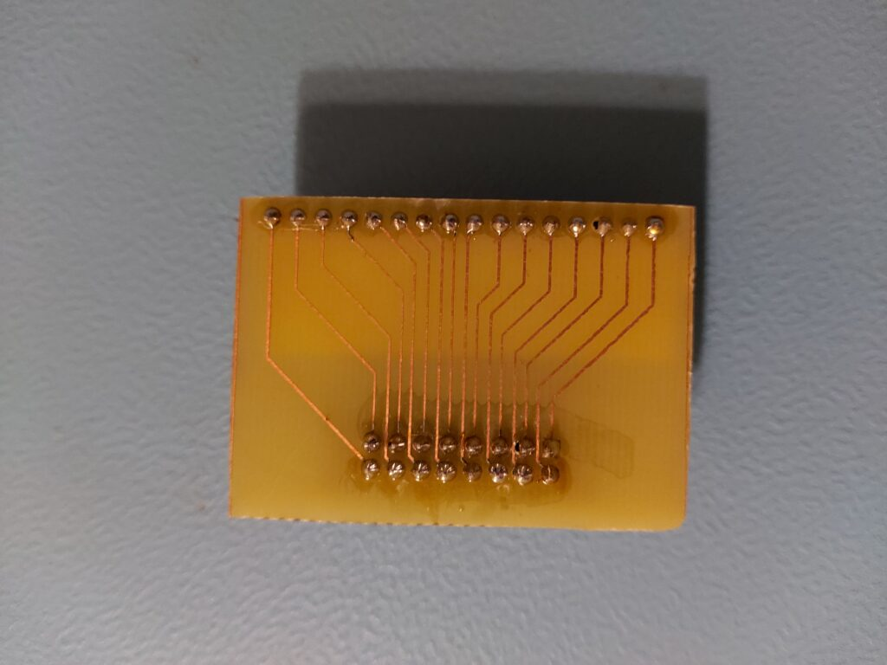

# PCB Etching

Something I've been trying to do for a long time is make my own PCBs. It has often gone wrong or not been optimal, but now i finally succeeded!

## KiCad

It all starts with a simple KiCad drawing. I convert this into a PCB as I would normally design it. I just pay a bit more attention to the thickness of the traces. For the trace thickness, I prefer to use 0.5mm; 0.25mm also works but can cause problems during etching. Another thing I pay close attention to is ensuring it's all single-sided (single layer), so no vias. Other than that, it's the same as if I were ordering it through JLCPCB.

## Special Paper and an Iron

After designing my PCB in KiCad, I print it mirrored onto special paper (yellow in appearance). This paper is yellow and has a plastic layer on one side, which does not allow the toner from my black-and-white printer to adhere well. Because it doesn't stick well, I can place it on a copper board and iron the design onto it. You iron it for two minutes, and then you have your PCB.

It took some trial and error to figure out how long and how exactly this works. But once you figure it out, it works quite well!

## Etching

I use Sodium Persulfate for etching. It's interesting stuff, especially for your clothes. The first time I used it was on a free evening, and I treated it as if it were water. The result was a dotted pajama, as over time the stuff ate holes into my pajamas.

Etching takes about 20-25 minutes, depending on how often the solution has been used and the temperature. I still need to buy myself a nice etching tank. Right now, I do it in a Tupperware container and risk getting it on my clothes every time.

## The Results

