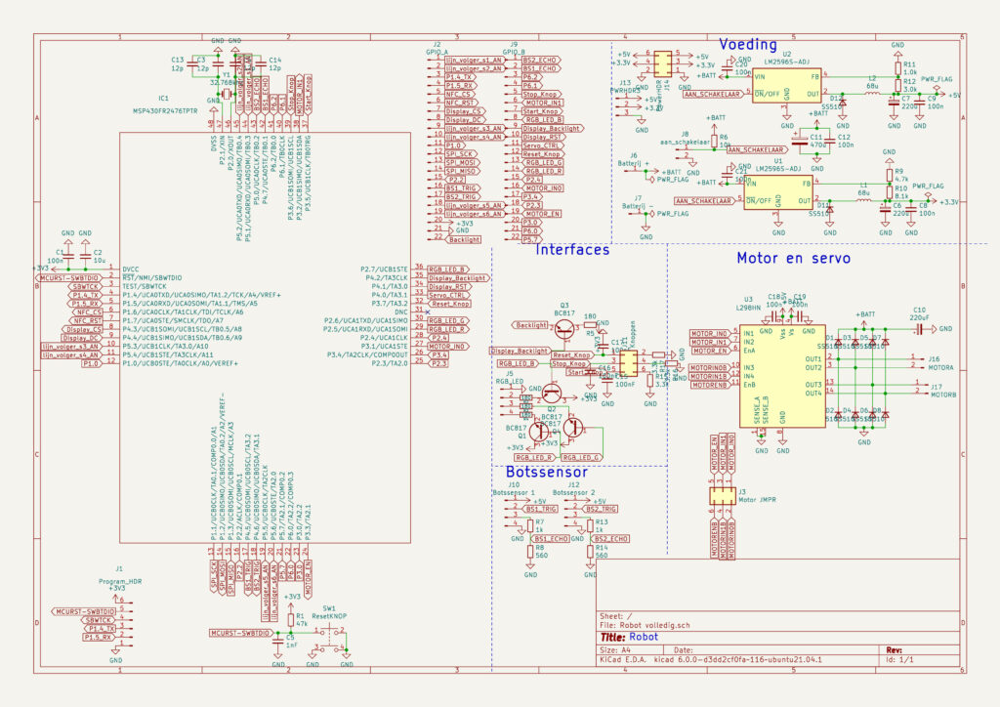

# Autonomous line following robot

The Second First-Year Project of my Electrical Engineering course at the University of Applied Sciences Rotterdam: Building a Robot that Can Independently Follow Black Lines on the Floor

## Assignment Explanation

The task is to build an autonomous robot with the following functions:

- The robot must be able to follow a line.
- The robot must be able to read NFC cards from the ground and process the data from these cards.
- The robot must not collide with anything.

## Project Requirements

### Non-Functional Customer Requirements

- **REQ-NF1[MH]**: The dimensions of the robot may not exceed: length = 297mm, width = 210mm, and height = 210mm.

- **REQ-NF2[MH]**: Only microcontrollers from the MSP430 series may be used.

- **REQ-NF3[MH]**: Breadboards are not allowed in the final product.

- **REQ-NF4[MH]**: (Wire) connections between the units must be made with the correct colors and thickness.

- **REQ-NF5[MH]**: A private repository on Bitbucket must be used for the software version control system.

### Functional Customer Requirements
- **F-REQ-1[MH]**: The robot must drive independently over a grid of black lines without cables or any form of remote control, at a minimum speed of 2π cm/s.
- **F-REQ-2[MH]**: The robot will never make contact with or drive over an object (both forwards and backwards) that is higher than 2.72 cm.
- **F-REQ-3[MH]**: The robot must be able to drive over objects with a height of 0.7 cm.
- **F-REQ-4[MH]**: The robot must track the distance traveled. Distances from 0 cm to 99,999 cm can be measured from the start signal. The maximum deviation is 15%.
- **F-REQ-5[MH]**: The robot must track the elapsed time, counting up to at least 99,999 seconds. The maximum deviation is 10%.
- **F-REQ-6[MH]**: The robot must be able to make decisions using NFC tags, which are placed on the grid (the path the robot must follow).
- **F-REQ-7[MH]**: The robot must be equipped with a start button to begin driving, a stop button to stop the robot, and a reset button to reset the displayed measurements.
- **F-REQ-8[MH]**: The robot must have a stop function. When this function is used, all collected data will be reported.
- **F-REQ-9[MH]**: The robot must be able to turn around if there is an object in its path.
- **F-REQ-10[MH]**: The robot must be able to operate on batteries.

**Note**: This project uses the Moscow method, meaning the requirements are categorized as Must have (MH), Could have (CH), or Should have (SH). However, all requirements in this case are must-haves 🙂.

## Component Choices

- MSP430FR2476 16-bit microcontroller is used as the brain for the robot.

- An L298N H-bridge for driving the motors.

- A Corona CS238MG for the steering mechanism.

- A TCRT5000 IR LED Module for detecting black lines on the ground.

- An HC-SR04 ultrasonic module for detecting obstacles in the path.

- An MFRC522 NFC module for reading NFC cards on the path.

- Two LM2596S-adj regulators (one for 5V and one for 3.3V).

- A module with a light gate as an encoder.

A printed circuit board (PCB) has been made for this project 🙂. Here are two photos of the PCB:

## PCB Schematic

This the PCB Schematic for this project:

