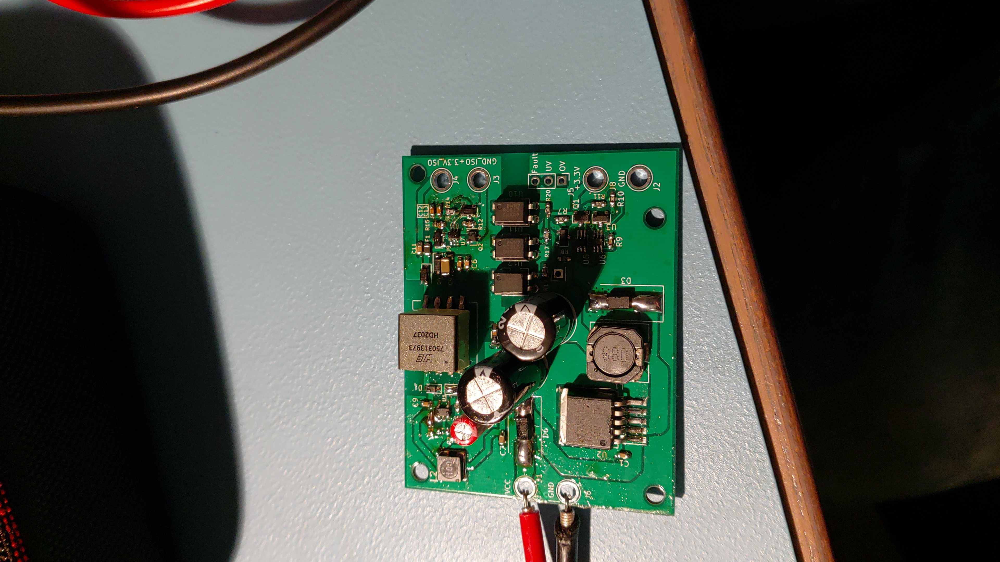
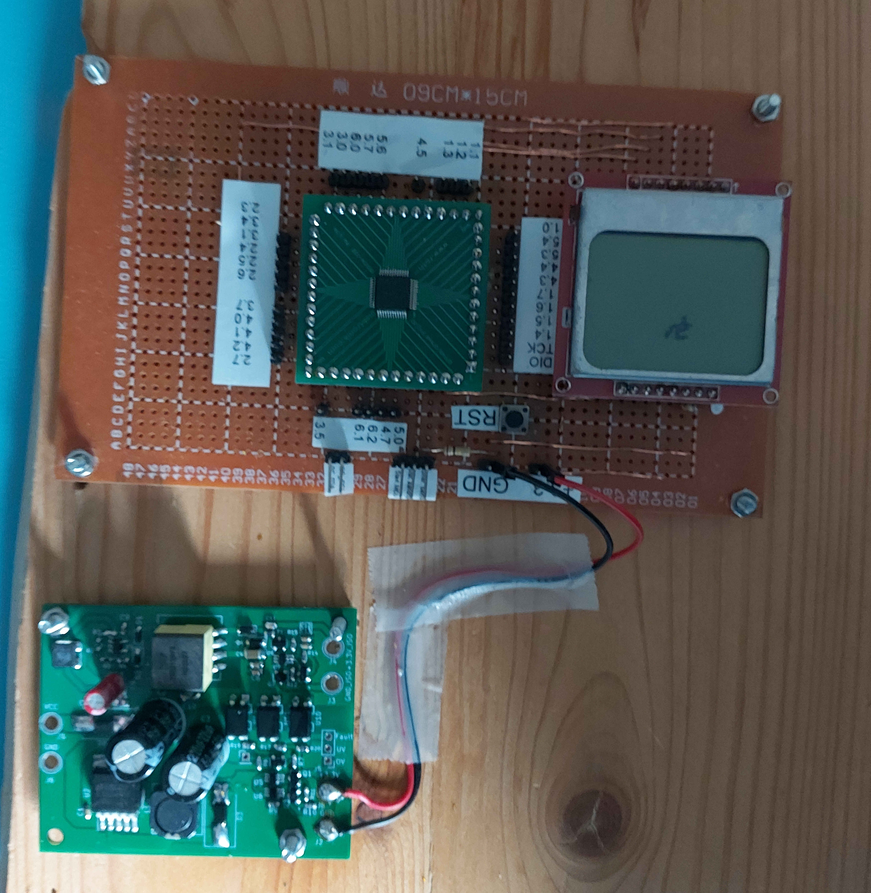

# Motor driver for rollerbank

For my first term project at the second year of the bachelor Electrical Engineering. A projectgroup of 4 other persons and me had to create a motor driver for a rollerbank. A rollerbank is typically used to check motor performance on motor verhicles. 

As this is a collaborative project the project was split-up in several components, we got the motor driver part of the assignment. This part is used to test the rollerbank. 

## Component selection

We designed a motor driver around a chopper design. The chopper had one big n-channel mosfet with a gate driver on the gate to make sure our set-up could reach switching speeds of ~1KHz. 

Another aspect of this project were the strict communication interface and safety requirements. This required us to add a microcontroller to the project. We were limited on time and knowledge so we used a MSP430 microcontroller, which we had already used in previous terms and subject/courses. This MSP430 communicated with isolated communication lines to the MPPT tracker and main controller of the rollerbank.

One big problem with the isolated communication lines was the lack of a power supply. The other teams did not discuss the option of adding a isolated supply. So we had to build this one too;

The supply thus consisted of a isolated flyback converter (with LT8301 ic) and a non-isolated buck-converter for internal use (LM2596s). 

